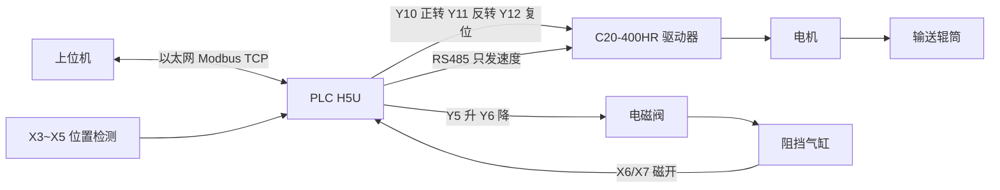
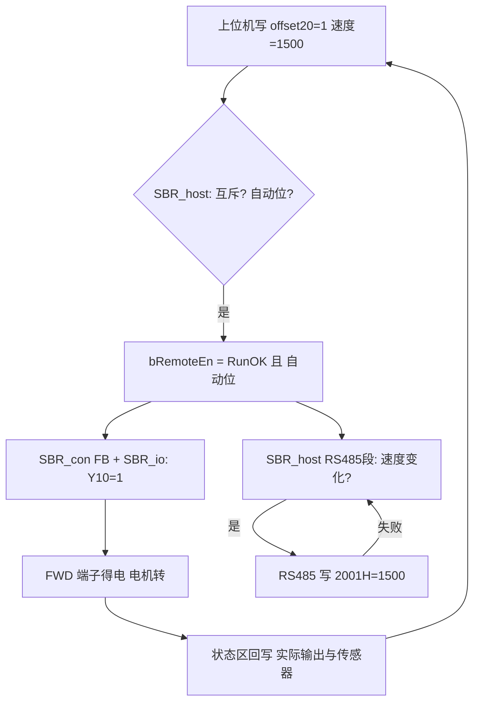
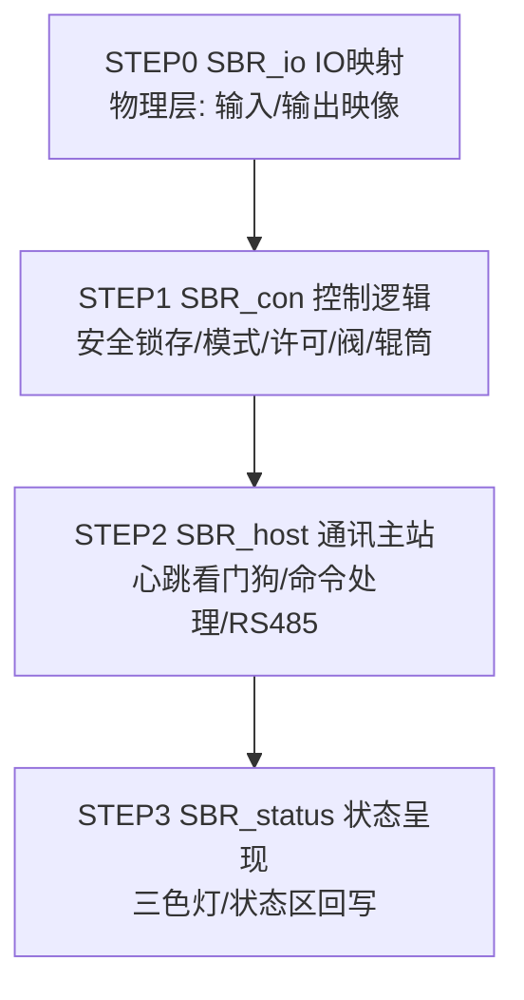

# 工程解读 — 辊筒上位机输送（新人导读）

> **阅读对象**：第一次上手本工程、具有初级电气知识的工程师。
> **素材版本**：v1.4.1（2026-08-26）。文中每个点位、数值均取自工程文件；
> 想核对时按「七、速查卡」打开对应文件即可。

---

## 一、这个工程是干什么的

一句话：**上位机（工控机）发命令 → H5U PLC 加工判断 → 控制输送辊筒转/停、调速，以及阻挡气缸升降**。现场没有固定自动流程（无工步），所有动作都由上位机远程指挥；旋钮打到"自动位"就是允许远程接管，打到"手动位"则输出全部切断、本地安全待机。

**三个关键澄清**（新人最容易搞错的地方）：

1. **C20-400HR 是"直流无刷电机驱动器"，不是变频器**。它带动电机传动辊筒。
2. **辊筒的"启停"和"调速"走两条不同的路**：
   - 启停/方向走**继电器端子线**——PLC 输出点 Y10(正转)、Y11(反转) 接驱动器的 FWD/REV 端子，像按下按钮一样简单直接；断开线，电机就停。
   - 调速走**通讯线(RS485)**——PLC 用 Modbus 协议把目标转速写进驱动器里"编号 2001 的参数格"(记作 2001H)，范围 0~3000，单位是 1 转/分钟。
3. **驱动器故障复位也走端子**——Y12 接 CLR 端子，远程命令来了 PLC 让它"闪"500 毫秒，相当于替人按了一下复位键。

---

## 二、设备与点位

### 设备清单

| 设备 | 型号/说明 | 与 PLC 的关系 |
|---|---|---|
| PLC | 汇川 H5U | 大脑，本工程的全部程序都在它里面 |
| 直流无刷驱动器 | 中大力德 C20-400HR | 带动电机传动辊筒；端子收启停指令，RS485 收速度 |
| 阻挡气缸 | 二位五通双电控阀控制 | Y5 得电升起、Y6 得电降下 |
| 位置检测 | 3 只传感器 X3/X4/X5 | 进料段/中段/出料段，有料为 1 |
| 磁性开关 | 2 只 X6/X7 | 气缸"确实升到位/降到位"的证据 |
| 三色灯+蜂鸣 | Y0 | out_LampYellow | 三色灯黄（手动位） |
| Y1 | out_LampGreen | 三色灯绿（自动位） |
| Y2 | out_LampRed | 三色灯红（报警） |
| Y3 | out_Buzzer | 蜂鸣器（报警随动） |
| 手自动继电器 | Y4 | 跟随旋钮状态对外转发 |

### 输入输出点位摘要

| 点位 | 变量名 | 含义 |
|---|---|---|
| X0 | in_eStop | 急停旋钮（**注意反逻辑**：TRUE=已释放=安全） |
| X1 | in_Reset | 复位按钮（解锁报警用） |
| X2 | in_ModeAuto | 手自动旋钮（TRUE=自动位） |
| X3~X5 | in_Pos1~3Sns | 三段位置检测 |
| X6/X7 | in_CylUp/DnSns | 气缸升/降到位磁开 |
| Y10 | out_RollerFwd | 驱动器正转端子 FWD |
| Y11 | out_RollerRev | 驱动器反转端子 REV |
| Y12 | out_RollerRst | 驱动器复位端子 CLR |
| Y5 | out_CylUp | 阀的升线圈 |
| Y6 | out_CylDn | 阀的降线圈 |

完整清单见 `变量表\VariableTable_io.csv`。

### 上位机通讯字（寄存器约定）

上位机和 PLC 约定好一批"信箱格"，各司其职（完整表见 `通讯字表.csv`）：

| 方向 | 地址(服务器地址) | 内容 |
|---|---|---|
| PLC←读 | 0 ~ 13 | 状态汇报：模式/急停/就绪/正反转中/气缸到位/报警/三段位置/当前速度/**出向心跳**(每 1 秒自增 1，证明"我还活着")/**报警字**(位编码汇总) |
| PLC→收 | 20 ~ 28 | 命令接收：正转启动/停止/反转/阻挡升/降/报警复位/驱动器复位/速度设定/**入向心跳**(上位机必须不停改变它，PLC 3 秒没看到变化就认定"上位机失联") |

**命令都是"触发式"的**：上位机把某格写成 1，PLC 执行完立刻清回 0 当"回执"。一格长期是 1 说明对方卡住了，不会被重复执行。

---

## 三、信号怎么流

以"上位机让辊筒正转并跑在 1500 转"为例，信号走三层：

**第 1 层·命令下行**：上位机往"辊筒正转启动"格(offset 20)写 1，同时往"速度设定"格(offset 27)写 1500。
PLC 在 SBR_host 里检查：三个命令格互斥吗？旋钮在自动位吗？都满足才收下——类比挂号信要有回执，且一次只办一件事（正转/反转/停止三格不能同时为 1）。

**第 2 层·执行出口**：SBR_con 计算 `bRemoteEn(远程允许)` = `bRunOK(运行许可)` 且 `bModeAuto(自动位)`。这相当于总开关串在回路里——手动位、急停、报警、断讯任何一项不满足，输出全断。
**急停命令注销（关键安全功能）**：控制层置 con_EstopActive（急停按下 **或** 锁存活跃）。通讯层在命令处理前先执行注销块：把 RollerRun / bRollerRev / con_CylCmd / bCylPos / con_SpeedTarget 全部清零，并拒绝一切入向命令字（清0回执）。这样急停按下时不仅输出被切断，**记忆中的命令也一并清除**——释放并复位后机器不会自动恢复旧动作，必须上位机重新下发指令。（速度命令 con_SpeedTarget 原是无条件赋值，已改为受 con_EstopActive 门控，避免漏清。）

**第 3 层·兵分两路**：
- 快路（一个扫描周期内）：SBR_con 的 FB 算出正转输出 → SBR_io 把 Y10 点亮 → 驱动器 FWD 端子得电 → 电机转起来；
- 慢路（几十毫秒级）：SBR_host 的 RS485 段发现速度和上次不一样了，通过 RS485 把 1500 写进驱动器的 2001H 格。写失败了也不慌——请求保留着，下个周期自动重试。

同时 PLC 把真实状态（Y10 是否真的亮了、传感器看到了什么）写进状态区供上位机回读——**上报的是实际输出，不是命令回声**。

### PLC 内部映射链：命令怎么一步步走到端子

"PLC 控制辊筒"不是一条指令完成的，而是一根**四环映射链**，每一环都能在代码里指出来：

| 环 | 从 → 到 | 所在文件 |
|---|---|---|
| ① 命令接单 | `host_Send_RollerStart`(D20) → 运行记忆量 `bRollerRun` | `SBR_host_通讯主站.st`（互斥检查 + 自动位门控 + 清0回执） |
| ② 逻辑加工 | `bRollerRun/bRollerRev` → FB 模块 `Roller_1` → 方向输出 `FwdOut/RevOut`（正反转死不同时为1） | `SBR_con_控制逻辑.st` FB 调用段 |
| ③ 许可门控 | `FwdOut/RevOut` → 逻辑输出量 `out_RollerFwd/out_RollerRev`（仅 `bRemoteEn` 时放行） | `SBR_con_控制逻辑.st` 输出逻辑量段 |
| ④ 物理映像 | `out_RollerFwd/out_RollerRev` → 真实端子 `Y10/Y11` | `SBR_io_IO映射.st` 输出映像段 |

非自动位时第①环直接拒绝：运行记忆量清零 + 命令字清0回执——**绝不产生"回执已给、动作没做"的假执行**；切回自动位后辊筒也不会自己恢复转动。

> 【自测题 1】上位机想让辊筒"换一个转速继续正转"，它该做什么？
> A. 只写"速度设定"格　B. 先发停止再发正转　C. 直接给驱动器打电话　D. 同时写正转+反转格

---

## 四、程序怎么组织

整个程序整理成**四张"工序卡片"**（四模块架构），PLC 每个扫描周期按固定顺序刷一遍（真源见 `SBR程序块\SBR_08_主调度.st`）：

| 模块 | 管什么 | 一句话类比 |
|---|---|---|
| `SBR_io` | 物理点↔逻辑量纯透传（X→in_*，out_*→Y） | 接线端子排 |
| `SBR_con` | 安全锁存、模式、远程许可、阀/辊筒控制、控制类输出 | 流水线的"操作工"（安全判断最先做） |
| `SBR_host` | 心跳看门狗、上位机命令接单、RS485 速度转发 | 前台收发室 |
| `SBR_status` | 三色灯蜂鸣、状态字回写 | 汇报员（最后统一对外呈现） |

**为什么控制层最先、状态层最后？** 先由 con 判断"能不能干"并完成全部控制计算，host 处理通讯事务，最后 status 把最新状态统一对外呈现——同一周期内对外永远是一套自洽的状态，不会出现"灯亮了但状态字还是旧值"的矛盾。

**FB 功能块 = 三块成品模块**（`FB\` 文件夹）：每个 FB 配两个文件——`_变量.csv` 是"接线图"（有哪些接口），`.st` 是"内部电路"（怎么运作，不许随便改动声明）：

| 成品模块 | 接口(简化) | 干什么 |
|---|---|---|
| FB_AlarmLatch | 故障源 + 复位命令 → AlarmOut | 报警锁存：一旦触发就"记仇"，故障消失还得按复位才放行 |
| FB_TowerLight | Fault/Auto/Manual → 红绿黄灯+蜂鸣 | 三色灯优先级：故障 > 自动 > 手动，绝不靠代码顺序碰运气 |
| FB_Roller | 正/反转请求+互斥 → FwdOut/RevOut | 辊筒方向互锁，两路输出死不同时为 1 |

变量分五本账本管理：`io`(物理点)/`const`(常量)/`con`(内部中间量)/`host`(上位机信箱)/`功能块实例`(成品模块装在哪)——ST 代码里出现的每个名字都能在这些 CSV 里找到户口。

> 【自测题 2】为什么安全回路排在扫描第一位？
> A. 名字靠前　B. 先判断能不能干，输出最后统一刷新　C. 执行快　D. 汇川规定

---

## 五、安全逻辑为什么这样设计

四个保护动作，每个都配一个"如果不这样做"的反例：

**1. 急停锁存（Latch_Estop）**
急停旋钮按下 → 锁存报警；解除条件苛刻：旋钮必须已物理释放 **且** 有人按复位（X1 本地或上位机远程命令）。
*反例*：如果不锁存，旋钮弹回来的瞬间设备自己恢复运转——旁边的人还没松手呢。

**2. 气缸到位看门狗（CYL_TIMEOUT = 3000ms）**
阀线圈给出后保持输出，直到对应磁开亮起"我到位了"；悬挂等待期间时间继电器(TONR)悄悄计时，3 秒还看不到磁开 → 触发 `con_CylTimeout` → 进入锁存闭环 → 切断运行许可。
*反例*：没有它，气管被压瘪时阀线圈一直通电干烧，气缸卡在哪都没人知道。

**3. 通讯看门狗（双心跳分离）**
入向心跳(offset 28)：上位机必须不停改变它，PLC 3 秒(COMM_HEART_TIMEOUT)没看到变化 → `con_CommLost` → 运行许可切断。出向心跳(offset 12)：PLC 每 1 秒自增 1 给上位机查岗。**两根心跳各走各的格，绝不复用**。
*反例*：共用一个心跳等于两个人拿同一块表对时——表停了双方都以为对方还在。

**4. 显式切断**
无许可时不指望"ELSE 分支兜底"，而是主动把 Y10/Y11/Y5/Y6 写 0，残留命令字同步清空。
*反例*：隐式默认像"忘了合闸但 assume 没电"——总有一次恰好是带电的。

### 报警字：一根总线管全部报警

四类异常最终不各走各的灯，而是先汇进一个 32 位"报警字"`con_AlarmWord`（D13 上报），**每个 bit 一类报警**，上位机读一个寄存器就知道全部病情：

| bit | 值 | 含义 | 需要复位吗 |
|---|---|---|---|
| 0 | 1 | 急停锁存 | 是（释放+复位） |
| 1 | 2 | 气缸到位超时锁存 | 是（故障消失+复位） |
| 2 | 4 | 通讯断讯 | 否（心跳恢复自动清除） |
| 3+ | 8… | 预留（驱动器故障等） | — |

运行许可的总闸就是它：`bRunOK := (con_AlarmWord = 0)`——**报警字为零才允许运行**。谁想新增报警，只需：检测源 →（该锁存的）接 FB_AlarmLatch → 汇编时加一个 bit → RunOK/灯/上位机三处自动生效，一处都不用再改。

> 【自测题 3】气缸升起命令发出后 3 秒，升到位磁开仍无信号，系统会？
> A. 自动下降重来　B. 无视继续等　C. 锁存报警、切断许可、需复位才能再动　D. 只有灯闪一下

---

## 六、动手试试

### 练习 A：调整气缸到位超时（最安全的第一次修改）

1. 打开 `变量表\VariableTable_const.csv`，找到第 1 行 `CYL_TIMEOUT`，初始值 3000（毫秒）；
2. 改成 5000，保存（GBK 编码，别用会改成 UTF-8 的编辑器）；
3. 在项目根目录运行门禁：`python scripts/ci_check.py` —— 必须显示 **0 ERROR**；
4. 完成！无需改任何 ST 代码——这就是常量集中管理的好处。

### 练习 B：新增一只传感器（走全流程）

1. `采集表\02_输入IO.csv` 加一行（如 X8 备用电感传感）；
2. `变量表\VariableTable_io.csv` 同步加行：变量名只能英文(如 `in_Pos4Sns`)，注释中文；
3. `SBR程序块\SBR_io_IO映射.st` 输入映像段加一行：`in_Pos4Sns := X8;`
4. 跑 `ci_check.py` 确认 0 ERROR。

**三条命名红线**（审查脚本会拦）：标识符只用英文字母/数字/下划线；注释一律中文；BOOL 初值写 OFF/ON、时间一律 DINT 毫秒（汇川没有 TIME 类型）。

---

## 七、速查卡

| 想做什么 | 打开哪个文件 |
|---|---|
| 查某个输入/输出点含义 | `变量表\VariableTable_io.csv` |
| 改超时/速度上限等常数 | `变量表\VariableTable_const.csv` |
| 看上位机寄存器约定 | `通讯字表.csv`（同目录 xlsx 为可视版） |
| 看程序执行顺序 | `SBR程序块\SBR_08_主调度.st` |
| 看输入/输出点怎么接线映射 | `SBR程序块\SBR_io_IO映射.st` |
| 看安全/阀/辊筒控制逻辑 | `SBR程序块\SBR_con_控制逻辑.st` |
| 看命令接收与速度转发 | `SBR程序块\SBR_host_通讯主站.st` |
| 看状态回写与三色灯 | `SBR程序块\SBR_status_状态呈现.st` |
| 理解某个成品模块 | 如 `FB\FB_Roller\FB_Roller_变量.csv` + `FB\FB_Roller\FB_Roller.st` |
| 查报警清单与阈值 | `采集表\06_报警参数.csv` |
| 了解为什么选这套架构 | `辊筒驱动方案说明.md` |
| 提交前自检 | 项目根 `python scripts/ci_check.py` |

---

## 附录：自测题答案

- **自测题 1：A**。正转已在进行，换速只需更新"速度设定"格(offset 27)；PLC 检测到变化经 RS485 重写 2001H。B 会造成不必要的停机；D 触发互斥保护被拒绝。
- **自测题 2：B**。先全局判断"能不能干"，所有计算完成后由输出刷新统一落地，避免同一周期内新旧状态混杂输出。
- **自测题 3：C**。超时触发 `con_CylTimeout` → Latch_Cyl 锁存 → bRunOK 断 → 所有远程输出切断；须故障消失+复位命令才解除。
